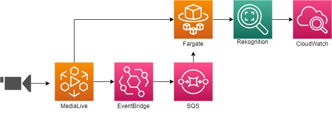

# AWS MediaLive Source Monitoring via Rekognition

This project is an example implementation of an AWS MediaLive Source Monitoring solution using AWS Rekognition. Deployment is via AWS Cloud Development Kit (CDK) and Python.

This repository contains all code artifacts for the following blog post:
[MediaLive Source Monitoring via Rekognition](https://aws.amazon.com/blogs/database/medialive-source-monitoring-via-rekognition/)


## Architecture



$~$
# Deploying the solution with AWS CDK

Deploying the solution with the AWS CDK The AWS CDK is an open-source framework for defining and provisioning cloud
application resources. It uses common programming languages such as TypeScript, Python, Java and .NET.
The [AWS CDK command line interface](https://docs.aws.amazon.com/cdk/latest/guide/cli.html) (CLI) allows you to interact
with CDK applications. It provides features like synthesizing AWS CloudFormation templates, confirming the security
changes, and deploying applications.

This section shows how to prepare the environment for running CDK and the sample code. For this walkthrough, you'll require the following prerequisites:

* An [AWS account](https://signin.aws.amazon.com/signin?redirect_uri=https%3A%2F%2Fportal.aws.amazon.com%2Fbilling%2Fsignup%2Fresume&client_id=signup).
* An IAM user with administrator access
* [Configured AWS credentials](https://docs.aws.amazon.com/cdk/latest/guide/getting_started.html#getting_started_prerequisites)
* Installed Node.js, Python 3, and pip. 
* Docker cli installed

$~$

When working with Python, it’s good practice to use [venv](https://docs.python.org/3/library/venv.html#module-venv) to
create project-specific virtual environments. The use of `venv` also reflects AWS CDK standard behavior. You can find
out more in the
workshop [Activating the virtualenv](https://cdkworkshop.com/30-python/20-create-project/200-virtualenv.html).


1. Clone the code from the GitHub repo
   ```bash
   git clone https://github.com/aws-samples/medialive-source-monitoring-via-rekognition.git
   ```

2. Switch in the new directory:
   ```bash
   cd medialive-source-monitoring-via-rekognition
   ```

3. Install the dependencies using the Python package manager:
   ```bash
   pip install -r requirements.txt
   ```

4. Specify the AWS region and account for your deployment:
   ```bash
   export CDK_DEPLOY_REGION=eu-west-1
   export CDK_DEPLOY_ACCOUNT=$(aws sts get-caller-identity | jq -r '.Account')
   ```

5. Switch to the folder ready to build the Docker container:
   ```bash
   cd ContainerBuild
   ```

6. Run the script to create the local Docker container and push to ECR
   ```bash
   ./create_container.sh
   ```

7. Return to root project directory:
   ```bash
   cd ..
   ```

8. Deploy the example code with the CDK CLI:
    ```bash
    cdk deploy MediaLiveRekognitionThumbnails
    ```

9. Once the Fargate service confirms a task is running in the deployed cluster, go to Cloudwatch -> All Metrics and the new metrics will be posted under "EmlRekognitionWatcher"

$~$
## Cleaning up

Once you have completed the deployment and tested the application, clean up the environment to avoid incurring extra
cost. This command removes all resources in this stack provisioned by the CDK:

```bash
cdk destroy
```

# Notes
This example solution will begin analysing thumbnails on any running channel in the account where it is deployed once active. Care should be taken not to exceed the [API quota](https://docs.aws.amazon.com/medialive/latest/ug/limits-api.html) for thumbnails on the account if are a lot of active encoding pipelines. The solution however could be extended by using MediaLive [tags](https://docs.aws.amazon.com/medialive/latest/ug/tagging.html) to control which channels are included/excluded from analysis.


# Security

See [CONTRIBUTING](CONTRIBUTING.md#security-issue-notifications) for more information.

# License

This library is licensed under the MIT-0 License. See the LICENSE file.
